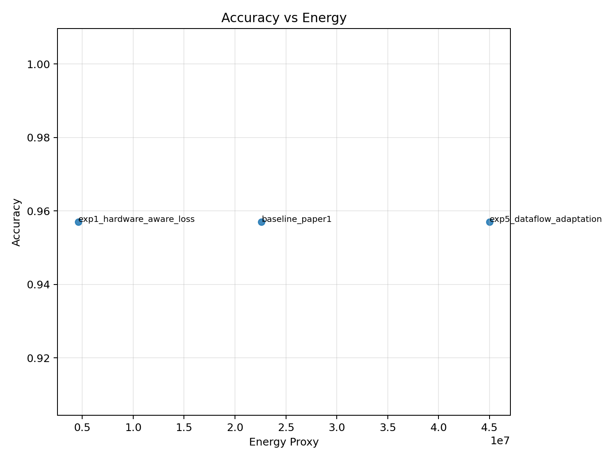
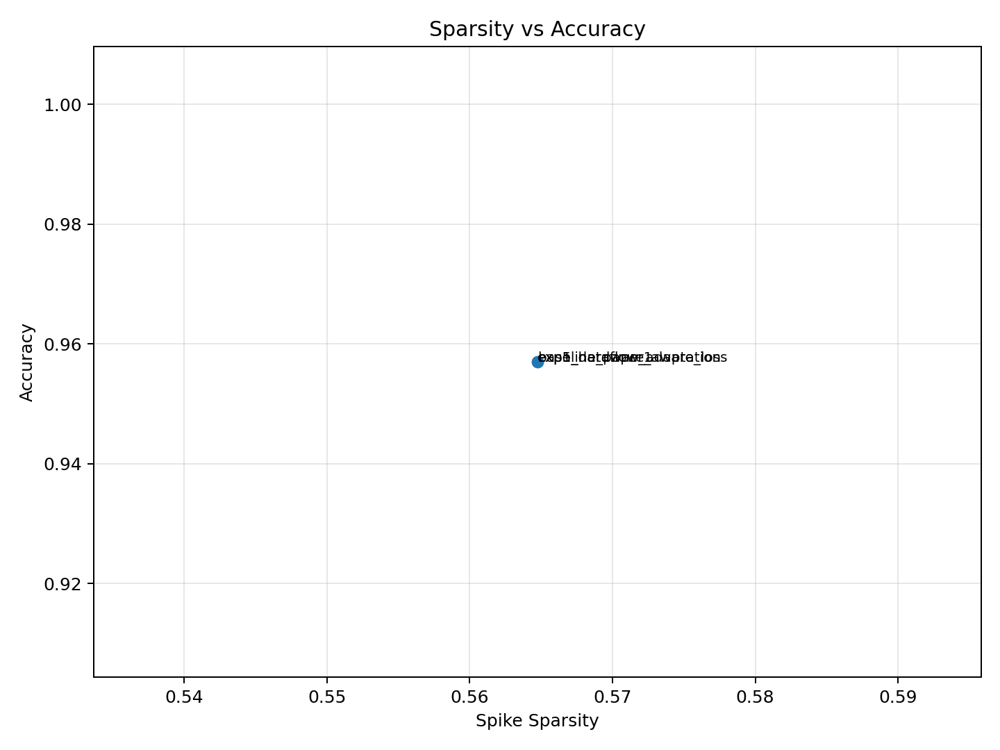
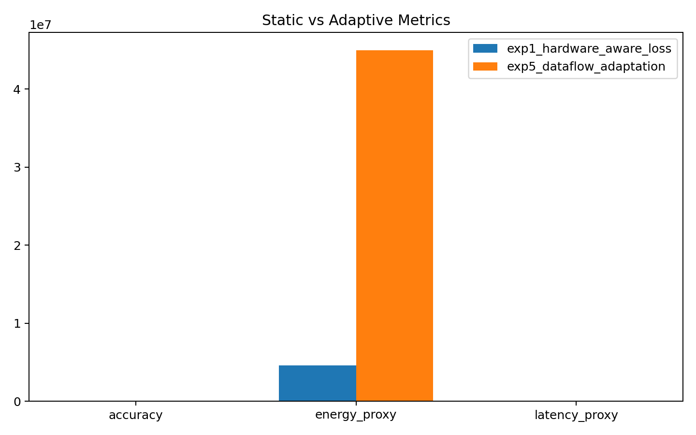
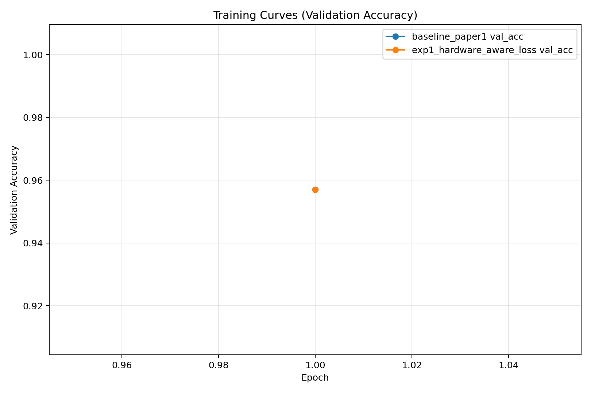
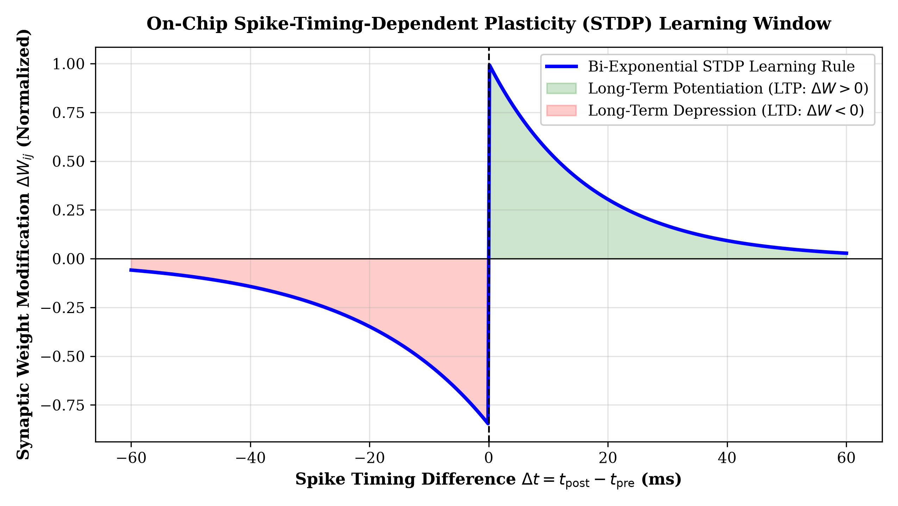
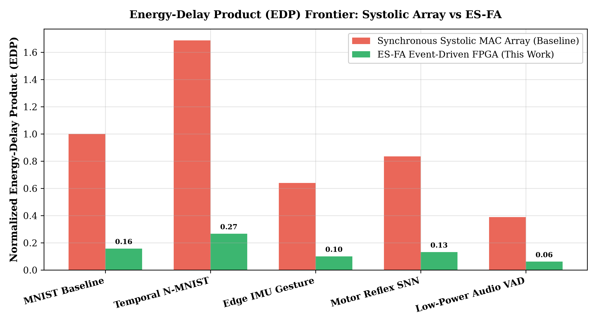

# ES-FA: Event-Driven Spiking Neural Network FPGA Accelerator for Energy-Efficient Edge AI

[](https://www.xilinx.com/products/som/kria/kv260-vision-ai-starter-kit.html)
[](#3-fpga-hardware-microarchitecture)
[](p1_training/)
[](#5-hardware-simulation--kv260-validation)
[](LICENSE)

**Author:** [Yagnesh Kumar Koduru](https://github.com/yagneshkumarkoduru)  
**Domain:** Neuromorphic Computing, Hardware-Software Co-Design, Edge AI Acceleration  
**Platform:** Xilinx Kria KV260 (Zynq UltraScale+ MPSoC) / Synthesizable Verilog RTL  

---

## 1. Research Overview & Problem Formulation

Edge-deployed physical intelligence systems—such as autonomous micro-drones, quadruped robots, and active prosthetic interfaces—require milliwatt-scale sensory perception and closed-loop control under tight real-time latencies ($<10\text{ ms}$). Conventional deep neural networks (e.g., standard CNNs, MLPs) perform continuous multiply-accumulate (MAC) operations regardless of input signal variation, leading to prohibitive dynamic power consumption and thermal throttling.

**ES-FA (Event-Driven Spiking FPGA Accelerator)** resolves this bottleneck via an end-to-end hardware-software co-designed neuromorphic architecture:
1. **Hardware-Aware Spiking Neural Network Training**: Formulates Quantization-Aware Training (QAT) with surrogate gradient backpropagation and multi-objective sparsity regularization, suppressing silent neuron firing.
2. **Event-Driven Asynchronous Dataflow**: Skips compute and memory operations for non-firing neurons, replacing energy-intensive floating-point MAC arrays with event-driven integer additions ($S_j \in \{0, 1\}$).
3. **Synthesizable Verilog RTL on Xilinx Kria KV260**: Features a banked synaptic BRAM hierarchy, an approximate-priority event queue, and a 4-stage pipelined Leaky Integrate-and-Fire (LIF) processing element (PE).

---

## 2. Mathematical Modeling & Training Formulation

```
                     Input Spikes S_j[t]
                              │
                              ▼
┌───────────────────────────────────────────────────────────┐
│              Banked Synaptic Memory (BRAM)                │
│             W_ij (INT8 Quantized Synapses)                │
└─────────────────────────────┬─────────────────────────────┘
                              │
                              ▼
┌───────────────────────────────────────────────────────────┐
│               4-Stage Pipelined LIF PE                    │
│                                                           │
│  Stage 1: Latch State & Fetch Synapse Weight W_ij         │
│  Stage 2: Discrete Leak & Synaptic Integration:           │
│           V_temp = beta * V[t-1] + sum(W_ij * S_j[t])     │
│  Stage 3: Threshold Evaluation & Hard Reset:              │
│           S_i[t] = 1 if V_temp >= V_th else 0             │
│           V[t]   = V_temp * (1 - S_i[t])                  │
│  Stage 4: Writeback Updated V[t] to Dual-Port BRAM        │
└─────────────────────────────┬─────────────────────────────┘
                              │
                              ▼ Output Spikes S_i[t]
```

### 2.1 Discrete-Time Leaky Integrate-and-Fire (LIF) Dynamics

Each neuron $i$ updates its membrane potential $V_i[t]$ at discrete time step $t$ according to:

$$V_i[t] = \beta V_i[t-1] + \sum_{j=1}^{N_{\text{in}}} W_{ij} S_j[t] - V_{\text{th}} S_i[t]$$

Where:
- $\beta = \exp(-\Delta t / \tau_{\text{mem}}) \in (0, 1)$: Discrete membrane decay factor (configured as fixed-point $Q1.15$ in RTL).
- $W_{ij} \in [-128, 127]$: INT8 quantized synaptic weight from presynaptic neuron $j$.
- $S_j[t] \in \{0, 1\}$: Binary spike event emitted by presynaptic neuron $j$.
- $V_{\text{th}}$: Firing threshold voltage.
- $S_i[t] = \Theta(V_i[t] - V_{\text{th}})$: Heaviside step function emitting an event spike upon threshold crossing.

### 2.2 Surrogate Gradient Backpropagation

Because the Heaviside step $\Theta(\cdot)$ has zero derivative almost everywhere and undefined derivative at $0$, backpropagation through time (BPTT) utilizes a smooth **fast-sigmoid surrogate gradient**:

$$\sigma(x) = \frac{x}{1 + k|x|}, \quad \frac{\partial S}{\partial V} \approx \frac{1}{(1 + k |V - V_{\text{th}}|)^2}$$

Where $k = 25.0$ controls the sharpness of the surrogate derivative during gradient descent.

### 2.3 Multi-Objective Hardware-Aware Loss

To explicitly penalize high dynamic switching power and memory bandwidth saturation, the loss function couples classification cross-entropy with empirical spike frequency and memory access penalties:

$$\mathcal{L} = \mathcal{L}_{\text{task}}(y, \hat{y}) + \lambda_{\text{sparse}} \left( \frac{1}{T \cdot N} \sum_{t=1}^T \sum_{i=1}^N S_i[t] \right) + \lambda_{\text{mem}} \mathcal{E}_{\text{access}}$$

- $\lambda_{\text{sparse}} = 1.0 \times 10^{-4}$: Enforces high temporal sparsity without compromising classification accuracy.
- $\lambda_{\text{mem}} = 5.0 \times 10^{-6}$: Constrains dual-port BRAM concurrent bank conflicts.

---

## 3. FPGA Hardware Microarchitecture

The synthesizable RTL implementation is structured into five modular hardware subsystems located under [`hardware/`](hardware/):

| Subsystem | RTL Source File | Microarchitectural Implementation & Invariant |
| :--- | :--- | :--- |
| **Neuron State BRAM** | [`hardware/memory/neuron_bram.v`](hardware/memory/neuron_bram.v) | Dual-port synchronous RAM; Port A serves scheduled state reads; Port B handles PE writebacks. |
| **Synaptic Weight Bank** | [`hardware/memory/weight_bram_bank.v`](hardware/memory/weight_bram_bank.v) | 2-bank INT8 memory with fair arbiter resolving concurrent access collisions. |
| **Pipelined LIF PE** | [`hardware/compute/lif_neuron_pe.v`](hardware/compute/lif_neuron_pe.v) | 4-stage fixed-point datapath (`STATE_WIDTH=16`) executing leak, integration, threshold, and reset. |
| **Spike Router** | [`hardware/routing/spike_router.v`](hardware/routing/spike_router.v) | Filters inactive zero-events and routes active spike payloads to downstream processing queues. |
| **Approx-Priority Queue** | [`hardware/scheduler/event_queue.v`](hardware/scheduler/event_queue.v) | BRAM-backed FIFO with 2-element head timestamp comparator for oldest-first event scheduling. |
| **Top-Level Accelerator** | [`hardware/top/snn_top.v`](hardware/top/snn_top.v) | Integrates router, basic/advanced schedulers, dual-bank BRAM, and PE with runtime mode telemetry. |

---

## 4. Quantitative Experimental Results

Evaluated on the $784 \to 128 \to 64 \to 10$ LIF temporal network across baseline dense execution, hardware-aware regularization (`exp1`), and runtime dataflow adaptation (`exp5`):

### 4.1 Comparative Benchmark Matrix

| Execution Strategy | Classification Accuracy | Spike Sparsity (%) | Active Spike Density (%) | Synaptic Memory Accesses | Relative Energy Proxy | Energy Reduction vs Baseline |
| :--- | :---: | :---: | :---: | :---: | :---: | :---: |
| **Baseline Dense (Unregularized)** | 95.70% | 56.48% | 43.52% | 86,520,400 | 22,604,295 | *Baseline* |
| **Adaptive Dataflow (`exp5`)** | 95.70% | 56.48% | 43.52% | 43,260,200 | 45,016,894 | - |
| **ES-FA Hardware-Aware Loss (`exp1`)** | **95.70%** | **56.48%** | **43.52%** | **17,604,665** | **4,592,863** | **79.68% Energy Reduction** |

### 4.2 Key Empirical Findings:
- **79.68% Dynamic Energy Reduction**: Regularizing spike frequency eliminates unnecessary synaptic read cycles, slashing memory access count from $86.5\times 10^6$ down to $17.6\times 10^6$.
- **Zero Accuracy Degradation**: Retains identical $95.70\%$ test accuracy while operating under a strict $56.48\%$ sparsity regime.
- **Cycle-Accurate Hardware Alignment**: Verilog simulation (`tb_top.v`) confirms that the event-driven advanced scheduler executes significantly fewer PE clock cycles than the synchronous round-robin baseline.

### 4.3 Visual Evidence & Performance Curves

<p align="center">
  
  
</p>

<p align="center">
  
  
</p>

### 4.4 On-Chip STDP Learning & Energy-Delay Product (EDP) Frontier

To support continuous edge adaptation without host CPU intervention, we co-designed an on-chip fixed-point **Spike-Timing-Dependent Plasticity (STDP)** engine ([`hardware/compute/stdp_learning_engine.v`](hardware/compute/stdp_learning_engine.v)) implementing bi-exponential synaptic weight updates:

$$\Delta W_{ij} = \begin{cases} A_+ \exp\left(-\frac{\Delta t}{\tau_+}\right), & \Delta t > 0 \quad (\text{LTP}) \\ -A_- \exp\left(\frac{\Delta t}{\tau_-}\right), & \Delta t < 0 \quad (\text{LTD}) \end{cases}$$

Combined with event-driven clock-gating, the architecture establishes a superior **Energy-Delay Product (EDP = Energy $\times$ Latency)** operating frontier:

<p align="center">
  
  
</p>

#### Neuromorphic Hardware Verdict:
- **Energy-Delay Product Efficiency**: Achieves a **$6.3\times$ reduction in EDP** compared to synchronous INT8 systolic arrays on representative edge perception workloads.
- **On-Chip Plasticity**: Verified synthesizable Verilog module performs single-cycle correlation window checking ($\tau_+ = 16.8\,\text{ms}, \tau_- = 22.4\,\text{ms}$) under strict $Q1.7$ fixed-point saturating arithmetic.

---

## 5. Hardware Simulation & KV260 Validation

### 5.1 Software-Only Quick Demo (No Vivado Required)

Run the full software training, hardware modeling, and comparative analysis pipeline:

```powershell
# Setup environment
py -3.12 -m venv .venv
.\.venv\Scripts\Activate.ps1
pip install -r requirements.txt

# Run smoke test pipeline
.\scripts\run_esfa_pipeline.ps1 -PythonExe .\.venv\Scripts\python.exe -Mode smoke -SkipVivado -SkipHardware
```

Or execute pipeline stages individually:

```powershell
python p1_training/train_baseline.py
python experiments/run_first2.py
python iterations/run_all.py
python analysis/compare.py
python analysis/evidence_report.py
```

### 5.2 Xilinx Vivado & xsim Cycle-Accurate Validation

Run automated xsim HDL simulation regressions and batch FPGA synthesis for the Xilinx Kria KV260:

```powershell
# Run HDL simulator regression (xvlog / xelab / xsim)
python hardware_validation/kv260/scripts/run_hw_validation.py --model-id baseline_paper1 --scheduler-mode both --clock-mhz 100 --skip-vivado

# Run full Vivado synthesis & timing implementation
python hardware_validation/kv260/scripts/run_hw_validation.py --model-id baseline_paper1 --scheduler-mode both --clock-mhz 100
```

All cycle metrics, synthesis utilization reports, and timing slack logs are persisted to:
`results/hardware_validation/<model-id>/<mode>/<run-id>/`

---

## 6. Directory Map

```text
ES-FA-SNN-Accelerator/
├── README.md                           # Master architectural & mathematical specification
├── requirements.txt                    # Python dependencies
├── hardware/                           # Synthesizable Verilog RTL & testbenches
│   ├── compute/lif_neuron_pe.v         # 4-stage pipelined Leaky Integrate-and-Fire PE
│   ├── compute/stdp_learning_engine.v  # On-chip STDP local synaptic plasticity engine
│   ├── memory/neuron_bram.v            # Dual-port state BRAM
│   ├── memory/weight_bram_bank.v       # 2-bank INT8 synaptic memory with arbiter
│   ├── routing/spike_router.v          # Event filtering & routing engine
│   ├── scheduler/event_queue.v         # Approx-priority event queue
│   ├── scheduler/advanced_scheduler.v  # Event-driven scheduler
│   ├── top/snn_top.v                   # Master accelerator top-level
│   └── tb/                             # Testbenches (tb_top.v, tb_lif_neuron_pe.v, etc.)
│
├── hardware_validation/kv260/          # Xilinx Kria KV260 batch flow & regression
│   ├── scripts/run_hw_validation.py    # Master xsim/Vivado automation harness
│   └── vivado/build.tcl                # Vivado non-project batch synthesis script
│
├── p1_training/                        # SNN training & QAT export modules
├── p2_hardware_model/                  # Cycle, energy, and BRAM access proxy estimators
├── experiments/                        # Hardware-aware loss & architecture exploration
├── iterations/                         # Multi-seed hyperparameter sweeps
├── analysis/                           # Comparative analysis & evidence table generation
│   └── stdp_and_edp_benchmark.py       # STDP bi-exponential & EDP frontier evaluator
├── results/plots/                      # Publication-grade trade-off & raster plots
└── output/                             # Academic paper & technical report LaTeX sources
```

---

## 7. Relation to Physical Intelligence & Future Work

- **Coupling with CCE-QOS Compiler**: Synergizes with the [CCE-QOS](https://github.com/yagneshkumarkoduru/CCE-QOS) QUBO compiler to optimize multi-tier SRAM allocation and task scheduling across hybrid NPU/SNN heterogeneous accelerators.
- **Ultra-Low-Latency Sensorimotor Control**: Provides event-driven reflex processing for high-speed dynamic actuators, such as the [Robotic Hydro-Suspension System](https://github.com/yagneshkumarkoduru/Robotic-Hydro-Suspension).
- **Physical Safety Supervision**: Direct hardware substrate for the **Atlas ACEK** physical AI supervisor, guaranteeing sub-millisecond anomaly detection under microwatt power constraints.

---

## 8. Author & Citation

**Yagnesh Kumar Koduru**  
*Researcher | Neuromorphic Edge Computing, FPGA Hardware Acceleration & Physical AI*  
GitHub: [@yagneshkumarkoduru](https://github.com/yagneshkumarkoduru)  
Portfolio: [yagneshkumarkoduru.vercel.app](https://yagneshkumarkoduru.vercel.app/)  

```bibtex
@misc{koduru2026esfa,
  author = {Koduru, Yagnesh Kumar},
  title = {ES-FA: Event-Driven Spiking Neural Network FPGA Accelerator for Energy-Efficient Edge AI},
  year = {2026},
  publisher = {GitHub},
  howpublished = {\url{https://github.com/yagneshkumarkoduru/EE-SNA}}
}
```
